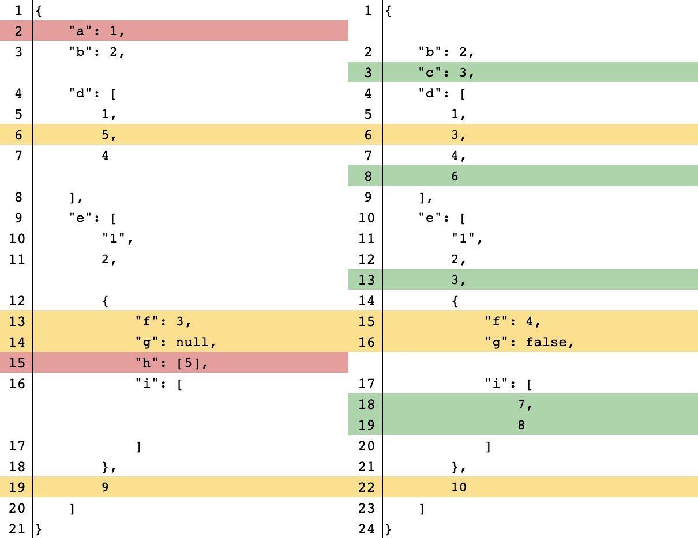

# JSON Diff Kit

[![NPM version][npm-image]][npm-url]
[![Downloads][download-badge]][npm-url]
[](https://codecov.io/gh/RexSkz/json-diff-kit)

A better JSON differ & viewer.

> Notice: considering most of the browsers now support ES6, this library has only the ES6 version. If you need the compatibility with older browsers, please configure the compiler in your project (e.g. add this library to the `include` field in `babel.config.js`).

## Install

You can install `json-diff-kit` via various package managers.

```sh
# using npm
npm i json-diff-kit --save

# using yarn
yarn add json-diff-kit

# using pnpm
pnpm add json-diff-kit
```

## Quick Start

To generate the diff data:

```ts
import { Differ } from 'json-diff-kit';

const before = {
  a: 1,
  b: 2,
  d: [1, 5, 4],
  e: ['1', 2, { f: 3, g: null, h: [5], i: [] }, 9],
};
const after = {
  b: 2,
  c: 3,
  d: [1, 3, 4, 6],
  e: ['1', 2, 3, { f: 4, g: false, i: [7, 8] }, 10],
};

// all configs are optional
const differ = new Differ({
  detectCircular: true,    // default `true`
  maxDepth: Infinity,      // default `Infinity`
  showModifications: true, // default `true`
  arrayDiffMethod: 'lcs',  // default `"normal"`
});

const diff = differ.diff(before, after);
console.log(diff);
```

You can use your own component to visualize the `diff` data, or use the built-in viewer:

```tsx
import { Viewer } from 'json-diff-kit';
import type { DiffResult } from 'json-diff-kit';

import 'json-diff-kit/dist/viewer.css';

interface PageProps {
  diff: [DiffResult[], DiffResult[]];
}

const Page: React.FC<PageProps> = props => {
  return (
    <Viewer
      diff={props.diff}  // required
      indent={4}         // default `2`
      lineNumbers={true} // default `false`
    />
  );
};
```

The result is here:



## More Complex Usages

Please check the [demo pages](https://json-diff-kit.js.org/).

## Algorithm Details

Please refer to the article [JSON Diff Kit: A Combination of Several Simple Algorithms](https://blog.rexskz.info/json-diff-kit-a-combination-of-several-simple-algorithms.html).

## License

MIT

[npm-url]: https://npmjs.org/package/json-diff-kit
[npm-image]: https://img.shields.io/npm/v/json-diff-kit.svg

[download-badge]: https://img.shields.io/npm/dm/json-diff-kit.svg
