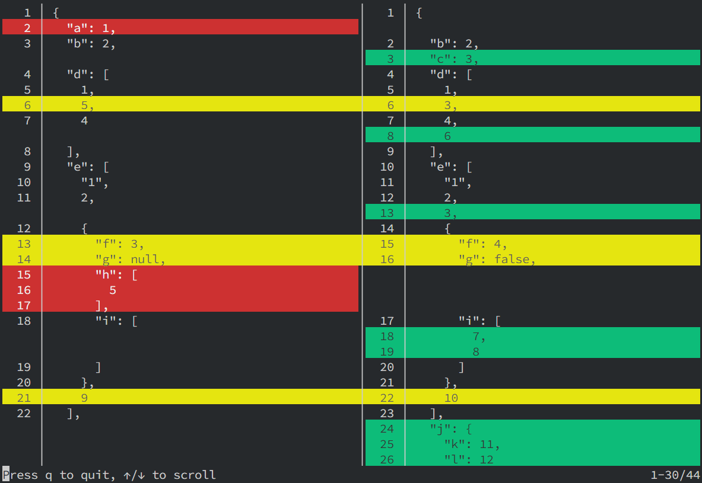

# JSON Diff Kit

[![NPM version][npm-image]][npm-url]
[![Downloads][download-badge]][npm-url]
[](https://codecov.io/gh/RexSkz/json-diff-kit)

A better JSON differ & viewer library written in TypeScript. [Try it out in the playground!](https://json-diff-kit.js.org/)

## Install

You can install `json-diff-kit` via various package managers.

```sh
# using npm
npm i json-diff-kit --save

# using yarn
yarn add json-diff-kit

# using pnpm
pnpm add json-diff-kit
```

## Quick Start

To generate the diff data:

```ts
import { Differ } from 'json-diff-kit';
// or if you are using vue, you can import the differ only
import Differ from 'json-diff-kit/dist/differ';

// the two JS objects
const before = {
  a: 1,
  b: 2,
  d: [1, 5, 4],
  e: ['1', 2, { f: 3, g: null, h: [5], i: [] }, 9],
  m: [],
  q: 'JSON diff can\'t be possible',
  r: 'Lorem ipsum dolor sit amet, consectetur adipiscing elit, sed do eiusmod tempor incididunt ut labore et dolore magna aliqua.',
  s: 1024,
};
const after = {
  b: 2,
  c: 3,
  d: [1, 3, 4, 6],
  e: ['1', 2, 3, { f: 4, g: false, i: [7, 8] }, 10],
  j: { k: 11, l: 12 },
  m: [
    { n: 1, o: 2 },
    { p: 3 },
  ],
  q: 'JSON diff is possible!',
  r: 'Lorem ipsum dolor sit amet, consectetur adipiscing elit, sed quasi architecto beatae incididunt ut labore et dolore magna aliqua.',
  s: '1024',
};

// all configs are optional
const differ = new Differ({
  detectCircular: true,    // default `true`
  maxDepth: Infinity,      // default `Infinity`
  showModifications: true, // default `true`
  arrayDiffMethod: 'lcs',  // default `"normal"`, but `"lcs"` may be more useful
});

// you may want to use `useMemo` (for React) or `computed` (for Vue)
// to avoid redundant computations
const diff = differ.diff(before, after);
console.log(diff);
```

You can use your own component to visualize the `diff` data, or use the built-in viewer:

```tsx
import { Viewer } from 'json-diff-kit';
import type { DiffResult } from 'json-diff-kit';

import 'json-diff-kit/dist/viewer.css';

interface PageProps {
  diff: [DiffResult[], DiffResult[]];
}

const Page: React.FC<PageProps> = props => {
  return (
    <Viewer
      diff={props.diff}          // required
      indent={4}                 // default `2`
      lineNumbers={true}         // default `false`
      highlightInlineDiff={true} // default `false`
      inlineDiffOptions={{
        mode: 'word',            // default `"char"`, but `"word"` may be more useful
        wordSeparator: ' ',      // default `""`, but `" "` is more useful for sentences
      }}
    />
  );
};
```

The result is here:


## More Complex Usages

Please check the [playground page](https://json-diff-kit.js.org/), where you can adjust nearly all parameters and see the result.

## CLI Tool

You can use the CLI tool to generate the diff data from two JSON files. Please install the package `terminal-kit` before using it.

```bash
pnpm add terminal-kit # or make sure it's already installed in your project

# Compare two JSON files, output the diff data to the terminal.
# You can navigate it using keyboard like `less`.
jsondiff run path/to/before.json path/to/after.json

# Output the diff data to a file.
# Notice there will be no side-by-side view since it's not a TTY.
jsondiff run path/to/before.json path/to/after.json -o path/to/result.diff

# Use a custom configuration file and output the diff data to a file.
jsondiff run path/to/before.json path/to/after.json -c path/to/config.json -o path/to/result.diff

# Print the help message.
jsondiff --help
jsondiff run --help
```



## Algorithm Details

Please refer to the article [JSON Diff Kit: A Combination of Several Simple Algorithms](https://blog.rexskz.info/json-diff-kit-a-combination-of-several-simple-algorithms.html?cc_lang=en).

## Features & Roadmap

- [x] Provide a `Differ` class and a `Viewer` component
- [x] Merge "remove & add" at the same place as a modification
- [x] Support inline diffing by word instead of by character
- [x] Generate code directly in the demo page (covered by playground)
- [x] Optimise `Viewer` performance by adding virtual scrolling
- [x] Add CLI tool
- [ ] Improve unit tests
- [ ] Provide a Vue version of `Viewer`

## License

MIT

[npm-url]: https://npmjs.org/package/json-diff-kit
[npm-image]: https://img.shields.io/npm/v/json-diff-kit.svg

[download-badge]: https://img.shields.io/npm/dm/json-diff-kit.svg
