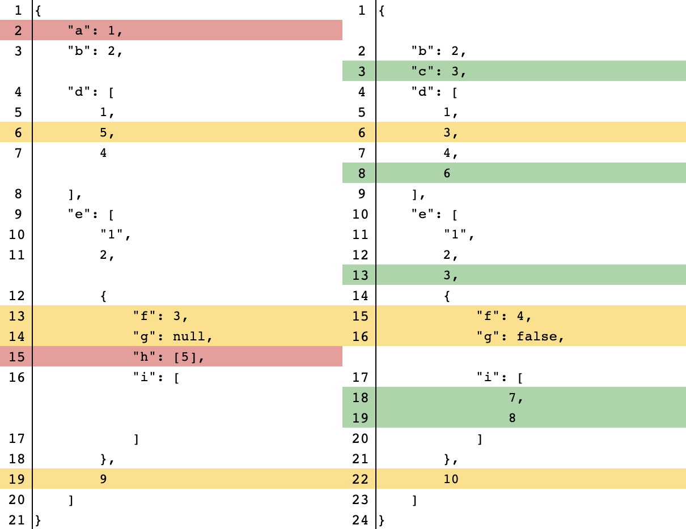

# JSON Diff Kit

[![NPM version][npm-image]][npm-url]
[![Downloads][download-badge]][npm-url]
[](https://codecov.io/gh/RexSkz/json-diff-kit)

> A better JSON differ & viewer library written in TypeScript. [Try it out in the playground](https://json-diff-kit.js.org/)!

## Installation

You can install `json-diff-kit` via various package managers.

```sh
# using npm
npm i json-diff-kit --save

# using yarn
yarn add json-diff-kit

# using pnpm
pnpm add json-diff-kit
```

## Usage

### Generate Diff Data

```typescript
import { Differ } from 'json-diff-kit';
// Vue users can import only the differ
import Differ from 'json-diff-kit/dist/differ';

const differ = new Differ({
  detectCircular: true,      // default: true
  maxDepth: Infinity,       // default: Infinity
  showModifications: true,   // default: true
  arrayDiffMethod: 'normal', // 'normal' | 'lcs' (default: 'normal')
});

const before = { a: 1, b: 2, m: [] };
const after = { b: 2, c: 3, m: [{ n: 1, o: 2 }] };

const diff = differ.diff(before, after);
// Returns: [DiffResult[], DiffResult[]]
```

### Render Diff Viewer

```tsx
import { Viewer } from 'json-diff-kit';
import type { DiffResult } from 'json-diff-kit';
import 'json-diff-kit/dist/viewer.css';

<Viewer
  diff={diff}                          // [DiffResult[], DiffResult[]] - required
  indent={2}                           // number - default: 2
  lineNumbers={false}                  // boolean - default: false
  highlightInlineDiff={false}         // boolean - default: false
  inlineDiffOptions={{
    mode: 'char',                     // 'char' | 'word' - default: 'char'
    wordSeparator: '',                 // string - default: ''
  }}
/>
```



## API Reference

### Differ Class

```typescript
new Differ(options?: DifferOptions)
```

| Option | Type | Default | Description |
|--------|------|---------|-------------|
| `detectCircular` | `boolean` | `true` | Detect circular references |
| `maxDepth` | `number` | `Infinity` | Maximum nesting depth |
| `showModifications` | `boolean` | `true` | Merge remove+add as modification |
| `arrayDiffMethod` | `'normal' \| 'lcs'` | `'normal'` | Array diff algorithm |

**Methods:**

```typescript
differ.diff(before: unknown, after: unknown): [DiffResult[], DiffResult[]]
```

### Viewer Component

**Props:**

| Prop | Type | Default | Description |
|------|------|---------|-------------|
| `diff` | `[DiffResult[], DiffResult[]]` | required | Diff data from Differ |
| `indent` | `number` | `2` | Indentation spaces |
| `lineNumbers` | `boolean` | `false` | Show line numbers |
| `highlightInlineDiff` | `boolean` | `false` | Highlight inline changes |
| `inlineDiffOptions.mode` | `'char' \| 'word'` | `'char'` | Char or word level diff |
| `inlineDiffOptions.wordSeparator` | `string` | `''` | Separator for word mode |

### Types

```typescript
interface DiffResult {
  path: (string | number)[];
  type: 'array' | 'object' | 'number' | 'string' | 'boolean' | 'null';
  oldValue?: unknown;
  newValue?: unknown;
  children?: DiffResult[];
}
```

## Vue Version

Experimental Vue component available: [json-diff-kit-vue](https://github.com/RexSkz/json-diff-kit-vue)

## CLI Tool

Requires `terminal-kit` package.

```bash
pnpm add terminal-kit
jsondiff run <before.json> <after.json>        # Terminal output
jsondiff run <before.json> <after.json> -o <output.diff>  # File output
jsondiff run <before.json> <after.json> -c <config.json>  # Custom config
```


## Algorithms

See [JSON Diff Kit: A Combination of Several Simple Algorithms](https://blog.rexskz.info/json-diff-kit-a-combination-of-several-simple-algorithms.html?cc_lang=en).

## Roadmap

| Status | Feature |
|--------|---------|
| ✅ | Differ class & Viewer component |
| ✅ | Merge remove+add as modification |
| ✅ | Word-level inline diff |
| ✅ | Virtual scrolling in Viewer |
| ✅ | CLI tool |
| ✅ | Vue version of Viewer |
| 🔄 | Improved unit tests |

## Playground

Test all parameters at [json-diff-kit.js.org](https://json-diff-kit.js.org/)

---

**License:** MIT

[npm-url]: https://npmjs.org/package/json-diff-kit
[npm-image]: https://img.shields.io/npm/v/json-diff-kit.svg
[download-badge]: https://img.shields.io/npm/dm/json-diff-kit.svg
